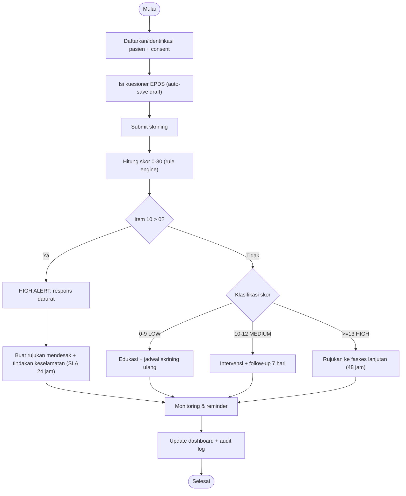
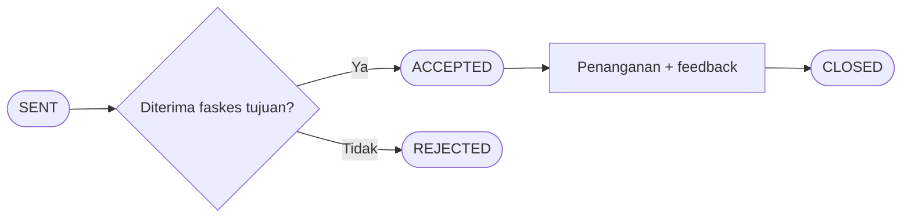

# 03 — Business Process & BPMN

## 3.1 Proses Bisnis Inti
1. Kader/Bidan mendaftarkan ibu (consent).
2. Petugas melakukan skrining EPDS (auto-save).
3. Sistem menghitung skor & menjalankan CDSS.
4. Berdasarkan risiko: edukasi (LOW), intervensi + follow-up (MEDIUM), rujukan (HIGH), atau respons darurat (HIGH ALERT).
5. Rujukan dilacak hingga closed-loop.
6. Reminder follow-up dikirim otomatis.
7. Data teragregasi ke dashboard & laporan; opsi push ke SATUSEHAT.

## 3.2 Diagram BPMN (alur skrining → keputusan)

## 3.3 Sub-proses Rujukan (closed-loop)

