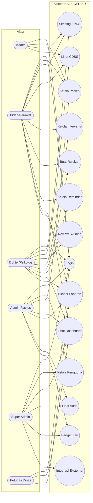
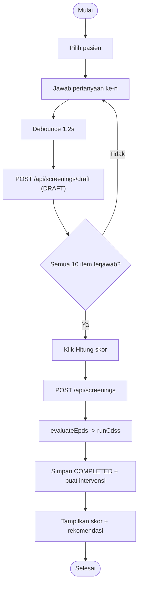
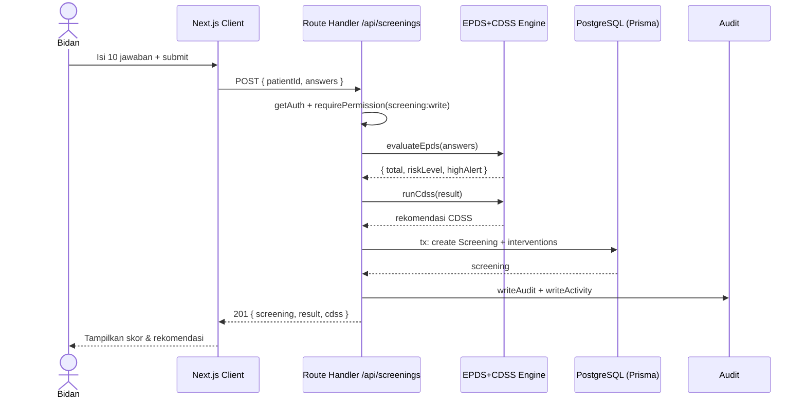
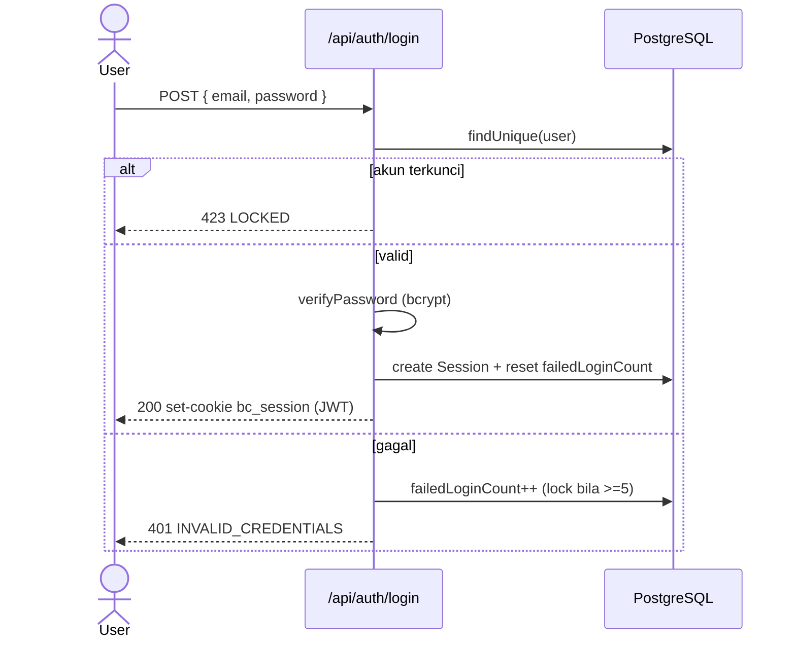
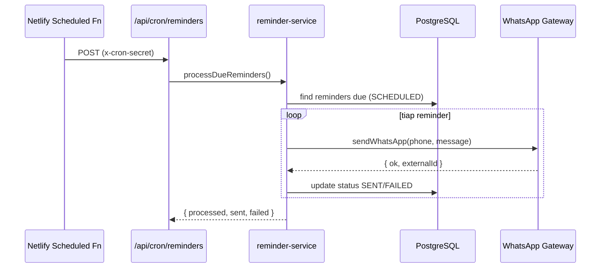

# 04 — Use Case, Activity & Sequence Diagram

## 4.1 Use Case Diagram

## 4.2 Activity Diagram — Skrining EPDS dengan Auto-save

## 4.3 Sequence Diagram — Submit Skrining

## 4.4 Sequence Diagram — Login + Lockout

## 4.5 Sequence Diagram — Reminder via WhatsApp (cron)

