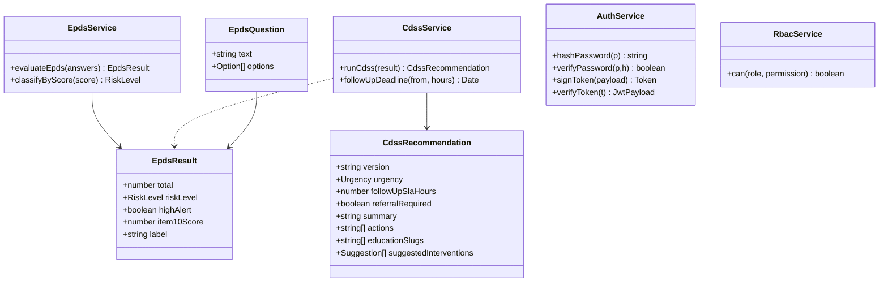
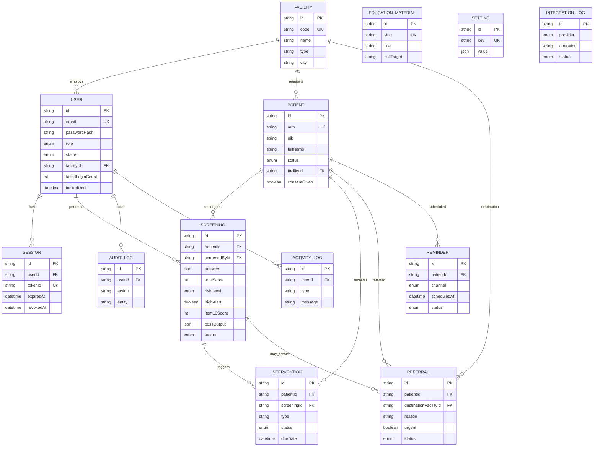

# 05 — Class Diagram & Entity Relationship Diagram (ERD)

## 5.1 Class Diagram (domain + service)

```mermaid
classDiagram
    class EpdsQuestion {
      +string text
      +Option[] options
    }
    class EpdsResult {
      +number total
      +RiskLevel riskLevel
      +boolean highAlert
      +number item10Score
      +string label
    }
    class CdssRecommendation {
      +string version
      +Urgency urgency
      +number followUpSlaHours
      +boolean referralRequired
      +string summary
      +string[] actions
      +string[] educationSlugs
      +Suggestion[] suggestedInterventions
    }
    class EpdsService {
      +evaluateEpds(answers) EpdsResult
      +classifyByScore(score) RiskLevel
    }
    class CdssService {
      +runCdss(result) CdssRecommendation
      +followUpDeadline(from, hours) Date
    }
    class AuthService {
      +hashPassword(p) string
      +verifyPassword(p,h) boolean
      +signToken(payload) Token
      +verifyToken(t) JwtPayload
    }
    class RbacService {
      +can(role, permission) boolean
    }
    EpdsService --> EpdsResult
    CdssService --> CdssRecommendation
    CdssService ..> EpdsResult
    EpdsQuestion --> EpdsResult
```

## 5.2 ERD

```mermaid
erDiagram
    FACILITY ||--o{ USER : employs
    FACILITY ||--o{ PATIENT : registers
    USER ||--o{ SESSION : has
    USER ||--o{ SCREENING : performs
    PATIENT ||--o{ SCREENING : undergoes
    SCREENING ||--o{ INTERVENTION : triggers
    PATIENT ||--o{ INTERVENTION : receives
    SCREENING ||--o{ REFERRAL : may_create
    PATIENT ||--o{ REFERRAL : referred
    FACILITY ||--o{ REFERRAL : destination
    PATIENT ||--o{ REMINDER : scheduled
    USER ||--o{ AUDIT_LOG : acts
    USER ||--o{ ACTIVITY_LOG : generates

    FACILITY {
      string id PK
      string code UK
      string name
      string type
      string city
    }
    USER {
      string id PK
      string email UK
      string passwordHash
      enum role
      enum status
      string facilityId FK
      int failedLoginCount
      datetime lockedUntil
    }
    SESSION {
      string id PK
      string userId FK
      string tokenId UK
      datetime expiresAt
      datetime revokedAt
    }
    PATIENT {
      string id PK
      string mrn UK
      string nik
      string fullName
      enum status
      string facilityId FK
      boolean consentGiven
    }
    SCREENING {
      string id PK
      string patientId FK
      string screenedById FK
      json answers
      int totalScore
      enum riskLevel
      boolean highAlert
      int item10Score
      json cdssOutput
      enum status
    }
    INTERVENTION {
      string id PK
      string patientId FK
      string screeningId FK
      string type
      enum status
      datetime dueDate
    }
    REFERRAL {
      string id PK
      string patientId FK
      string destinationFacilityId FK
      string reason
      boolean urgent
      enum status
    }
    REMINDER {
      string id PK
      string patientId FK
      enum channel
      datetime scheduledAt
      enum status
    }
    EDUCATION_MATERIAL {
      string id PK
      string slug UK
      string title
      string riskTarget
    }
    SETTING {
      string id PK
      string key UK
      json value
    }
    INTEGRATION_LOG {
      string id PK
      enum provider
      string operation
      enum status
    }
    AUDIT_LOG {
      string id PK
      string userId FK
      string action
      string entity
    }
    ACTIVITY_LOG {
      string id PK
      string userId FK
      string type
      string message
    }
```
